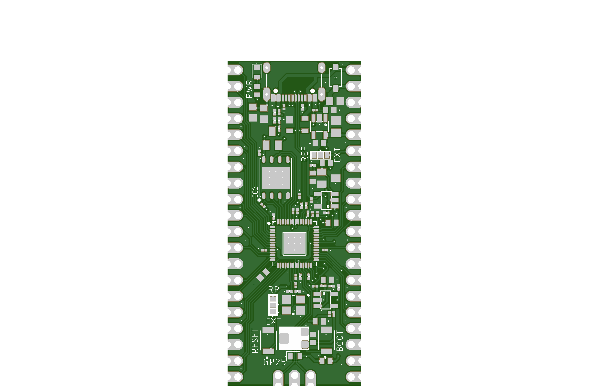
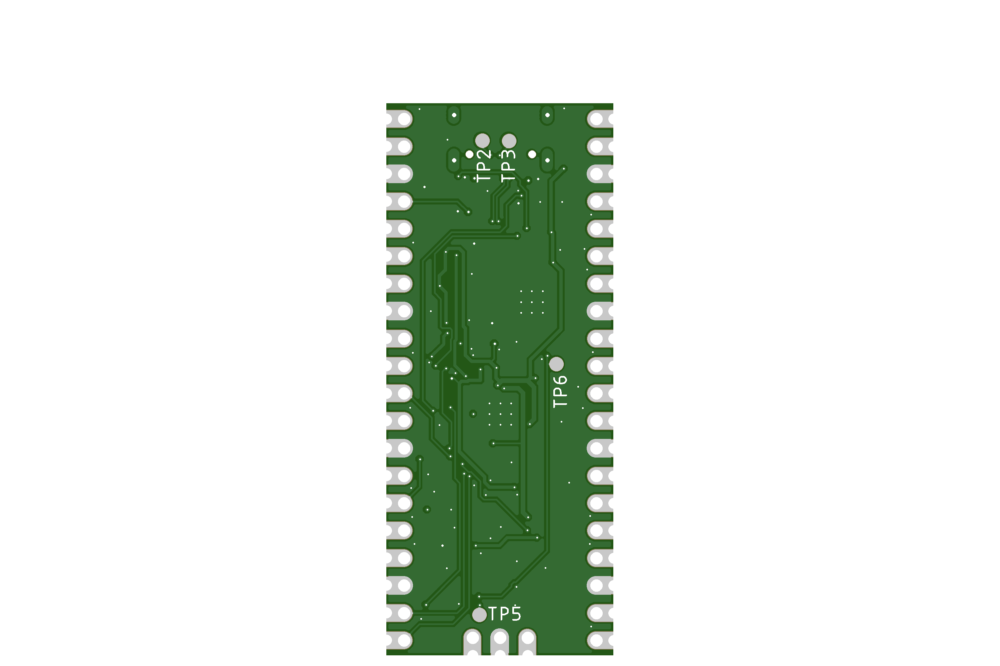

# RePico

RePico is a custom-designed, feature-enhanced Raspberry Pi Pico-compatible board built for serious embedded developers. It keeps full compatibility with the RP2040 ecosystem while upgrading key components for cleaner analog performance, improved configurability, and professional-grade layout.

    
    

---

## 🔧 Key Hardware Features

- **USB-C** connector instead of Micro-USB for modern connectivity.
- **Low-noise 3.3V power supply** using `MIC5504-3.3YM5` 3.3V 300mA LDO (replaces noisy SMPS).
- **Selectable ADC Vref** via jumper:
  - External Vref input.
  - Internal precision 3.0V reference using `LM4040` + buffered by `MCP6001RT-I/OT`.
- **Selectable Vcore Supply** via jumper:
  - Use internal RP2040 regulator.
  - Or use onboard external 1.1V regulator based on `AP7335-WG-7` with adjustable output.
- **Adjustable Vcore Tuning** with trimpot-based feedback:

| Trimpot Resistance | Vcore Output |
|--------------------|---------------|
| 25k (max)          | ~1.00 V       |
| 12.5k (mid)        | ~1.18 V       |
| 0 Ω (min)          | ~1.24 V       |

- **128Mbit (16MB) QSPI Flash** — 4x more than the standard Pico.
- **RESET** and **BOOT** buttons included onboard.
- **4-layer impedance-controlled PCB** for signal integrity.

---

## PCB Stackup

- **Total Layers:** 4
- **Finished Thickness:** ~1.56 mm ±10%
- **Outer Copper Weight:** 1 oz
- **Inner Copper Weight:** 0.5 oz
- **Material:** JLC04161H-3313 (FR4)

### Layer Stackup

| Layer | Description       | Material                    | Thickness (mm) |
|-------|-------------------|-----------------------------|----------------|
| L1    | Signal (Top)      | Outer Copper 1 oz           | 0.0350         |
|       | Prepreg           | 3313 RC57%, 4.2 mil         | 0.0994         |
| L2    | Internal Plane    | Inner Copper 0.5 oz         | 0.0152         |
|       | Core              | 1.3 mm H/HOZ with copper     | 1.2650         |
| L3    | Internal Plane    | Inner Copper 0.5 oz         | 0.0152         |
|       | Prepreg           | 3313 RC57%, 4.2 mil         | 0.0994         |
| L4    | Signal (Bottom)   | Outer Copper 1 oz           | 0.0350         |
|       | **Total Thickness** |                             | **1.5588 mm**  |

---

## 📏 Controlled Impedance Configuration

| Impedance (Ω) | Type                     | Signal Layer | Top Ref | Bottom Ref | Trace Width (mm) | Trace Spacing (mm) | Trace to Copper (mm) |
|---------------|--------------------------|--------------|---------|-------------|-------------------|---------------------|-----------------------|
| 50            | Coplanar Single Ended    | L1           | /       | L2          | 0.1486            | /                   | 0.2032                |
| 90            | Coplanar Differential    | L1           | /       | L2          | 0.1488            | 0.1778              | 0.2032                |
| 90            | Coplanar Differential    | L4           | L3      | /           | 0.1488            | 0.1778              | 0.2032                |
| 50            | Coplanar Single Ended    | L4           | L3      | /           | 0.1486            | /                   | 0.2032                |

---

## 🧠 RP2040 Pinout Compatibility

All RP2040 GPIOs are exposed through 2.54mm castellated headers, maintaining full compatibility with the original Raspberry Pi Pico pinout. 

---

## Misc: Core Voltage & Overclocking

To overclock the MCU, it's possible to supply more than 1.1 V to the core.  
By default, **external core voltage generation** is enabled using the **AP7335-WG-7**, which is activated via **J1**.  
The output voltage is set by adjusting the **R1 trimpot**.

> ⚠️ It is safe — the voltage range is limited by design and cannot damage the MCU.

### Voltage Range (Set by Divider)

| R1 (Trimpot) | Total Resistance (R28 + R1) | VOUT (approx) |
|--------------|----------------------------|----------------|
| 25 kΩ (max)  | 47 kΩ                       | 1.02 V         |
| 12.5 kΩ      | 34.5 kΩ                     | 1.14 V         |
| 0 Ω (min)    | 22 kΩ                       | 1.22 V         |

### Use Cases

- **Low Power Mode:** R1 = 25 kΩ → ~1.02 V  
- **Default / Safe:** R1 = 12.5 kΩ → ~1.14 V  
- **High Performance / Overclocking:** R1 = 0 Ω → ~1.22 V  

### VOUT Behavior Across Temperatures and Trim Settings

The AP7335-WG-7 regulator is affected by temperature-dependent reference voltage (VREF), output voltage accuracy, and resistor tolerances.  
This section outlines the **worst-case VOUT values** at cold, normal, and hot temperatures, across all trimpot settings.

> ⚙️ **Calculation Parameters:**
> - VOUT Accuracy: ±2% (from AP7335-WG-7 datasheet)
> - VREF Variation: Based on VREF vs. Temperature graph  
>   - −50 °C → 0.89 V  
>   - 25 °C → 0.80 V  
>   - 125 °C → 0.782 V
> - Resistors used: 1% tolerance (R27 = 12 kΩ, R28 = 22 kΩ, R1 = 0–25 kΩ trimpot)

The RP2040's **absolute maximum core voltage is 1.3 V** — values exceeding this may cause damage.

---

### ❄️ Cold (–50 °C, VREF = 0.89 V)

**Max Trim (R1 = 25 kΩ, Rb = 47 kΩ)**  
VOUT: **1.090 V – 1.144 V** ✅ Safe

**Mid Trim (R1 = 12.5 kΩ, Rb = 34.5 kΩ)**  
VOUT: **1.170 V – 1.230 V** ✅ Safe

**Min Trim (R1 = 0 Ω, Rb = 22 kΩ)**  
VOUT: **1.339 V – 1.413 V** ❌ Danger – exceeds RP2040 1.3 V limit

---

### 🌤️ Normal (25 °C, VREF = 0.80 V)

**Max Trim (R1 = 25 kΩ, Rb = 47 kΩ)**  
VOUT: **0.980 V – 1.029 V** ✅ Safe

**Mid Trim (R1 = 12.5 kΩ, Rb = 34.5 kΩ)**  
VOUT: **1.051 V – 1.106 V** ✅ Safe

**Min Trim (R1 = 0 Ω, Rb = 22 kΩ)**  
VOUT: **1.201 V – 1.265 V** ✅ Safe

---

### 🔥 Hot (125 °C, VREF = 0.782 V)

**Max Trim (R1 = 25 kΩ, Rb = 47 kΩ)**  
VOUT: **0.958 V – 1.005 V** ✅ Safe

**Mid Trim (R1 = 12.5 kΩ, Rb = 34.5 kΩ)**  
VOUT: **1.028 V – 1.082 V** ✅ Safe

**Min Trim (R1 = 0 Ω, Rb = 22 kΩ)**  
VOUT: **1.180 V – 1.243 V** ✅ Safe

## License
This project is licensed under the GPL-3.0 License. See the [LICENSE](LICENSE) file for details.

## Contact
For questions or feedback:
- Email: [dvidmakesthing@gmail.com](mailto:dvidmakesthing@gmail.com)
- GitHub: [DvidMakesThings](https://github.com/DvidMakesThings)
